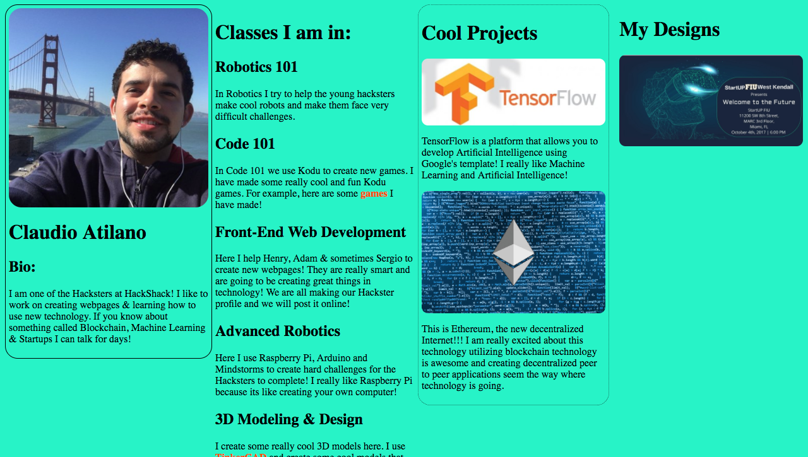

# HackShackProfile
Hey guys, this is how you push to github!

1. make sure that the folder you are working on is appearing on Visual Studio Code
2. open the terminal with the shortcut...control^` (Mac) or cntr+` (PC)
3. When you type in the command line I will write a $ to let you know to type in the command line
4. <code>$ git add .</code>
5. <code>$ git commit -m "Insert your update message here"</code>
6. <code>$ git push origin master</code>
 
<h1>This is what you should aim your profile to be like:</h1>

The key things I want you guys to understand are:
1. How to use the div tags
2. How to use the < style > tag (this is basically CSS) 
3. Have good readable code structure!
4. Use GitHub!

If you get lost or want to add something I didn't add on please use Google and Stack Overflow!
